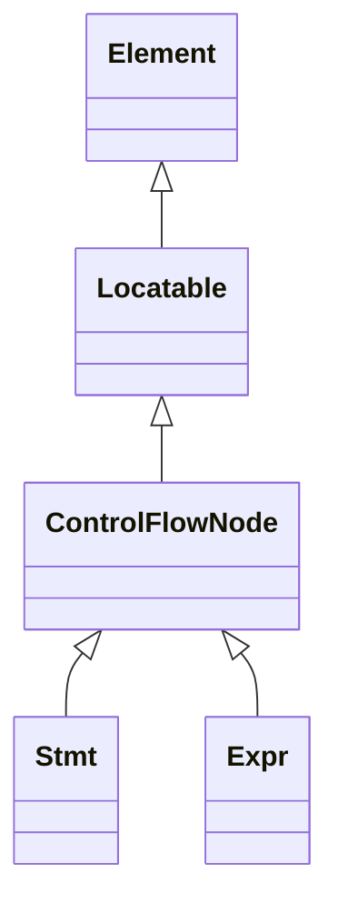

# Type Hierachy

This is just a sample summarizing the most importand types, for a full type hierarchy see the official API documentation!

```mermaid
classDiagram
  Element <|-- Locatable
  Locatable <|-- ControlFlowNode
  ControlFlowNode <|-- Stmt
  ControlFlowNode <|-- Expr
```
